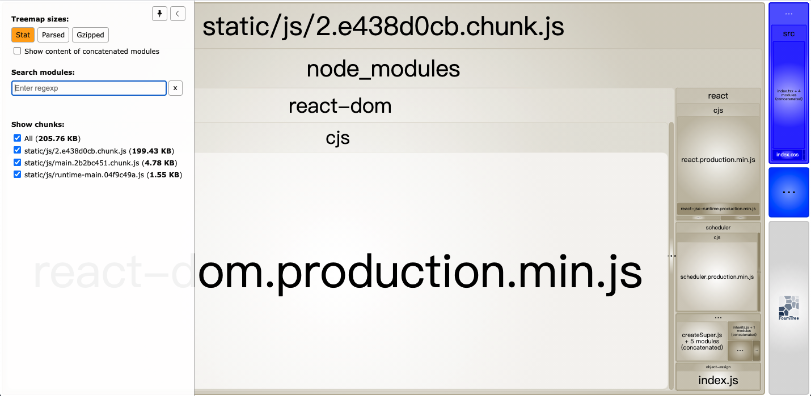
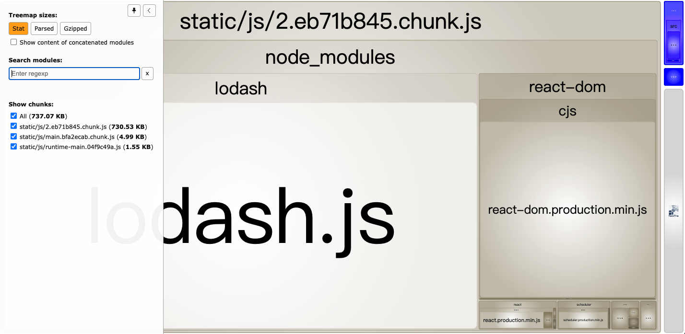

# 关于 React 打包优化的研究

## 现象及问题

- 引入 lodash 导致打包体积增加
- 引入 antd 导致打包体积增加
- 引入 moment 导致打包体积增加

## 原因分析

- TODO
- TODO

<BR>

## 开始验证

### 准备工作

1. 增加 lodash，antd，moment 依赖
    ```
    yarn add lodash antd moment
    yarn add @types/lodash -D
    ```

2. 安装打包分析插件
  - 增加 webpack-bundle-analyzer 依赖，配置 webpack，用于跟踪打包文件的组成部分，进行可视化分析。\
    但是，使用 create-react-app 生成的 project，不执行 yarn reject 的话，无法修改直接 plugin 配置，可通过下面的方法实现

    ```
    yarn add webpack-bundle-analyzer -D
    ```

    ```
    const BundleAnalyzerPlugin = require('webpack-bundle-analyzer').BundleAnalyzerPlugin;
    module.exports = {
      plugins: [
        new BundleAnalyzerPlugin()
      ]
    }
    ```

  - 对 react-scripts/config/webpack.config.js 进行扩展
    - 加入webpack-bundle-analyzer进行打包文件大小分析
    - 加入progress-bar-webpack-plugin跟踪打包进度
    - 加入speed-measure-webpack-plugin，查看打包时每个步骤消耗的时间
    - 为了验证方便，关闭eslint-webpack-plugin，加快打包速度（在build-prod.js中设置DISABLE_ESLINT_PLUGIN，加快2s+）
    - 为了验证方便，关闭postcss-loader，加快打包速度（在webpack.config.js中关闭getStyleLoaders()的postcss-loader，加快1.8s+）
  
    具体方案见 react-build-optimize/scripts/build-prod.js

  - 或者使用 create-react-app 官方推荐的 source-map-explorer 进行打包分析。缺点是 UI 比较简陋
    ```
    yarn add source-map-explorer -D
    ```
    接着在 package.json 中添加
    ```
    "scripts": {
      ...
      "analyze": "source-map-explorer 'build/static/js/*.js'",
      ...
    },
    ```

### **测试案例**

1. 不引入依赖包，查看 bundle 文件大小及组成
   
2. 引入 lodash，查看 bundle 文件大小及组成
   
3. 引入 antd，查看 bundle 文件大小及组成
4. 引入 moment，查看 bundle 文件大小及组成

### 优化方案

1. lodash 优化方式
   - cherry pick 按需加载模式引入 lodash，查看 bundle 文件大小及组成
   - 使用 lodash-webpack-plugin + babel-plugin-lodash 进行优化
2. antd 优化方式
   - TODO
   - TODO
3. moment 优化方式
   - TODO
   - TODO

## 参考

- [lodash 打包体积优化及原理](https://www.jianshu.com/p/f03ff4f3a8b3)
- [解决 React+Ant Design 打包后 vendors.js 过大问题](https://blog.csdn.net/qq_36400206/article/details/104605580)
- [Prettier 看这一篇就行了](https://zhuanlan.zhihu.com/p/81764012)
- [Prettier 官网](https://prettier.io/docs/en/)
- [如何在不执行`yarn reject`的情况下，修改 webpack 配置](https://medium.com/@romanonthego/webpack-bundle-analyzer-for-create-react-app-9aebb0d01084)
