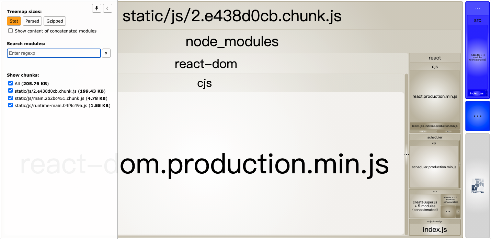
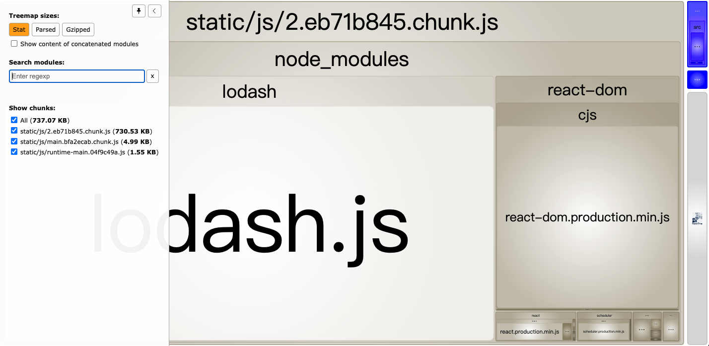
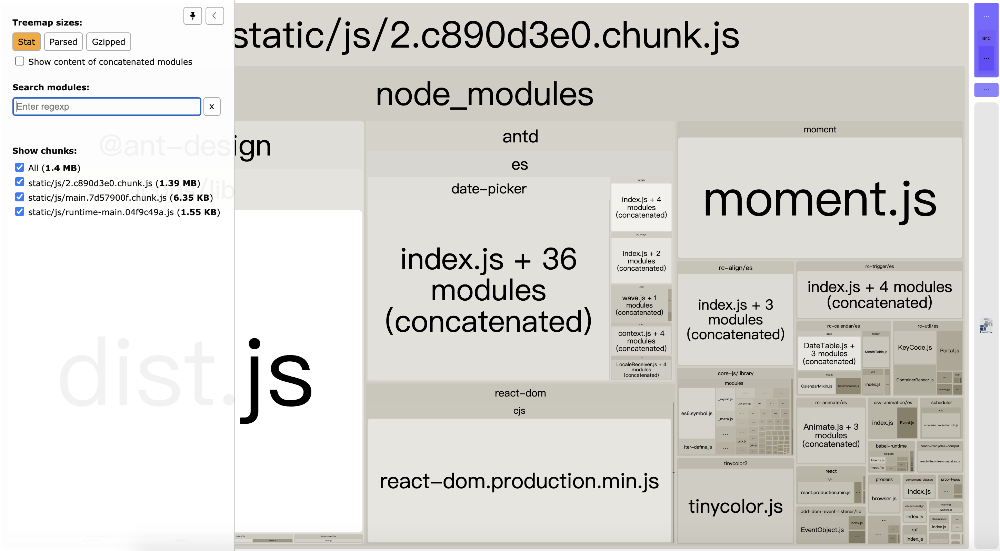
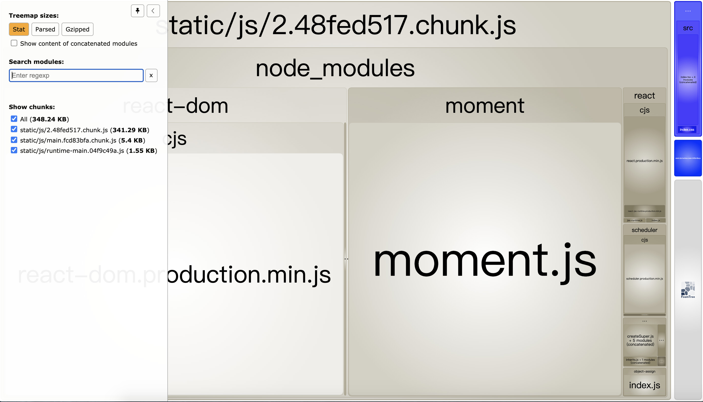
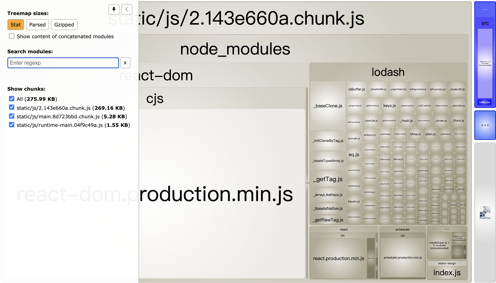
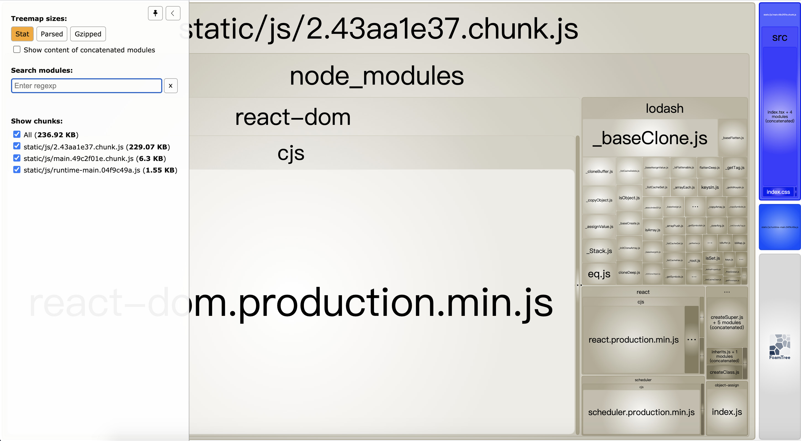
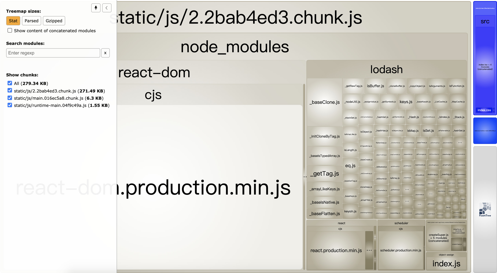
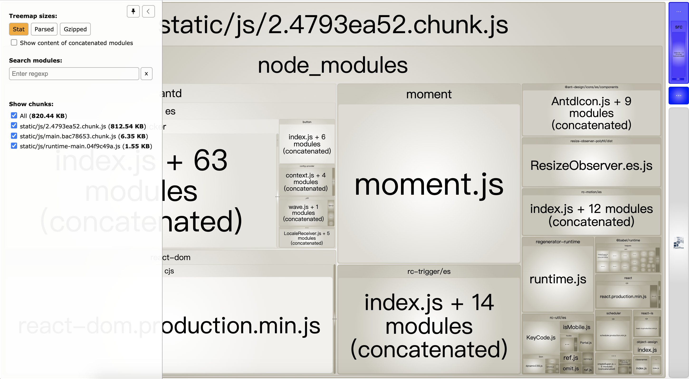

# 浅谈 React+Webpack 打包优化

## 现象及问题

- 引入 lodash 导致打包体积增加
- 引入 antd 导致打包体积增加
- 引入 moment 导致打包体积增加

## 原因分析

- webpack的tree shaking是基于ES6 Module特性实现的。
  - 只能作为模块顶层的语句出现
  - import 的模块名只能是字符串常量
  - import binding 是 immutable的

  >ES6模块依赖关系是确定的，和运行时的状态无关，可以进行可靠的静态分析，这就是tree-shaking的基础。\
  所谓静态分析就是不执行代码，从字面量上对代码进行分析，ES6之前的模块化，比如我们可以动态require一个模块，只有执行后才知道引用的什么模块，这个就不能通过静态分析去做优化。\
  这是 ES6 modules 在设计时的一个重要考量，也是为什么没有直接采用 CommonJS，正是基于这个基础上，才使得 tree-shaking 成为可能，这也是为什么 rollup 和 webpack 2 都要用 ES6 module syntax 才能 tree-shaking。

- 全局引入lodash模块，其实是把所有的子模块都引入进来了。虽然只用了其中一个，或几个方法，但是由于lodash模块不是基于ES6进行导出的，webpack build的时候，无法进行静态检测，只能把整个模块都打包进来。
- antd3.x版本，耦合了@ant-design/icons，打包的时候，会自动将所有的icons也打进去。最新的antd4版本，已经将icon移除，如果想使用，需要单独安装@ant-design/icons依赖。同时，最新版本默认支持[按需加载](https://ant.design/docs/react/introduce-cn#按需加载)，支持ES module导入导出。build时，只打包使用的组件，不会整体打包。
- moment之前的版本，打包的时候，即使未设置locale，也会默认把所有的locale包也打进去。但是最新的2.29.1版本，将locale隔离了，如果项目中未手动引入，将不会打包。因此，如果想手动设置locale的时候，不引入对应的locale的话，将不起作用。

<BR>

## 开始验证

### 准备工作

1. 增加 lodash，antd，moment 依赖
    ```
    yarn add lodash antd moment
    yarn add @types/lodash -D
    ```

2. 安装打包分析插件
  - 增加 webpack-bundle-analyzer 依赖，配置 webpack，用于跟踪打包文件的组成部分，进行可视化分析。\
    但是，使用 create-react-app 生成的 project，不执行 yarn reject 的话，无法修改直接 plugin 配置，可通过下面的方法实现

    ```
    yarn add webpack-bundle-analyzer -D
    ```

    ```
    const BundleAnalyzerPlugin = require('webpack-bundle-analyzer').BundleAnalyzerPlugin;
    module.exports = {
      plugins: [
        new BundleAnalyzerPlugin()
      ]
    }
    ```

  - 对 react-scripts/config/webpack.config.js 进行扩展
    - 加入webpack-bundle-analyzer进行打包文件大小分析
    - 加入progress-bar-webpack-plugin跟踪打包进度
    - 加入speed-measure-webpack-plugin，查看打包时每个步骤消耗的时间
    - 为了验证方便，关闭eslint-webpack-plugin，加快打包速度（在build-prod.js中设置DISABLE_ESLINT_PLUGIN，加快2s+）
    - 为了验证方便，关闭postcss-loader，加快打包速度（在webpack.config.js中关闭getStyleLoaders()的postcss-loader，加快1.8s+）
    - 为了支持.babelrc，需要修改react-scripts/config/webpack.config.js，开启babel-loader的配置文件
  
    具体方案见 react-build-optimize/scripts/build-prod.js

  - 或者使用 create-react-app 官方推荐的 source-map-explorer 进行打包分析。缺点是 UI 比较简陋
    ```
    yarn add source-map-explorer -D
    ```
    接着在 package.json 中添加
    ```
    "scripts": {
      ...
      "analyze": "source-map-explorer 'build/static/js/*.js'",
      ...
    },
    ```

### **测试案例**

1. 不引入依赖包，查看 bundle 文件大小及组成
   

2. 引入 lodash，查看 bundle 文件大小及组成
   

3. 引入 antd，查看 bundle 文件大小及组成
   
   
4. 引入 moment，查看 bundle 文件大小及组成
   

### 优化方案

1. lodash 优化方式
   - cherry pick 按需加载模式引入 lodash，查看 bundle 文件大小及组成

      `import cloneDeep from 'lodash/cloneDeep';`
      

   - 使用 lodash-webpack-plugin + babel-plugin-lodash 进行优化

      `yarn add lodash-webpack-plugin babel-plugin-lodash -D`

      配置webpack.config
      ```
      const LodashModuleReplacementPlugin = require('lodash-webpack-plugin')
      module.exports = {
        // ... 其他配置
        module: {
          rules: [{
            test: /\.js$/,
            exclude: /node_modules/,
            use: {
              loader: 'babel-loader',
              options: {
                presets: ['@babel/preset-env'],
                plugins: ['lodash']
              }
            }
          }]
        },
        plugins: [
          // ... 其他插件
          new LodashModuleReplacementPlugin()
        ]
      }
      ```
      

   - 使用babel-plugin-import进行优化
      


2. antd 优化方式
   - 最新的antd版本，默认支持按需加载，支持ES module导入导出。

      升级到antd4.15.1版本，打包后bundle文件大小及组成
      

3. moment 优化方式
   - 最新的2.29.1版本，将locale隔离了，如果项目中未手动引入，将不会打包。


## 参考

- [lodash 打包体积优化及原理](https://www.jianshu.com/p/f03ff4f3a8b3)
- [解决 React+Ant Design 打包后 vendors.js 过大问题](https://blog.csdn.net/qq_36400206/article/details/104605580)
- [Prettier 看这一篇就行了](https://zhuanlan.zhihu.com/p/81764012)
- [Prettier 官网](https://prettier.io/docs/en/)
- [如何在不执行`yarn reject`的情况下，修改 webpack 配置](https://medium.com/@romanonthego/webpack-bundle-analyzer-for-create-react-app-9aebb0d01084)
- [Tree-Shaking性能优化实践 - 原理篇](https://juejin.cn/post/6844903544756109319)
- [Webpack Tree-Shaking](https://v4.webpack.js.org/guides/tree-shaking/)
- [npm babel-plugin-import](https://www.npmjs.com/package/babel-plugin-import)
- [npm lodash-webpack-plugin](https://www.npmjs.com/package/lodash-webpack-plugin)
- [npm babel-plugin-lodash](https://www.npmjs.com/package/babel-plugin-lodash)
